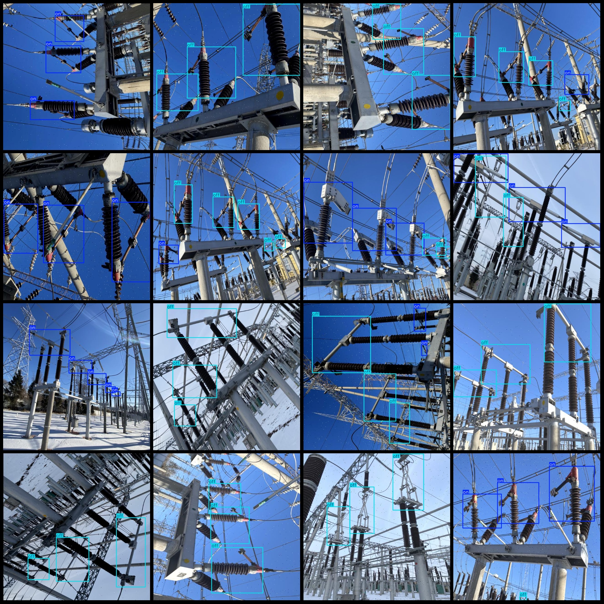
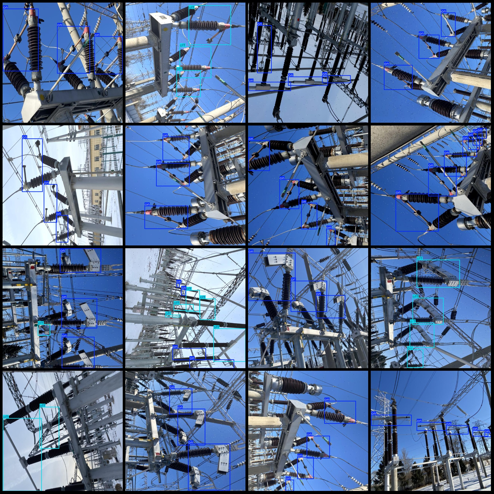

# Power Scenery: Switch State Detection Dataset in VOC+YOLO format with 1156 images and 2 categories with enhanced

Please note that approximately 1/3 of the dataset consists of original images, while the remaining images are enhanced using a 1:2 ratio. Please review the image previews carefully.
Dataset format: Pascal VOC format + YOLO format (without split paths in the txtfile, only including jpg images along with their corresponding VOC format xmlfile and YOLO format txtfile).
number of images: 1156  
annotation count: 1156  
annotation count:  1156
annotationnumber of classes: 2
Annotation class names (notice that the order of YOLO format class is not consistent with this one, and it is based on the labels file's classes.txt): ["off", "on"]
boxes per class:   
The given number is $2135$.
On (Open) box count = 2652
total boxes: 4787  
Number of images per category:
off images = 760  
The number of pictures owned is 877.
The image resolution is 640x640.
Use annotation tool: labelImg
Annotation rules: draw a box around the class.
Important notes: The dataset needs to be divided into training, validation, and test sets, which should be done by oneself.
Special Notice: This dataset does not guarantee the accuracy of the trained model or the weight files.
Image preview:
## Images

Here is a pay link on Stripe ( https://buy.stripe.com/3cs8yP7sY87d0vu9AB ). Please contact me lonlonago@foxmail.com after funding $89, and I will send you a complete data files , thank you!

